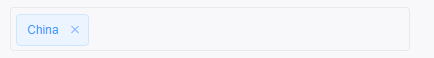

# El Input Tag
Element UI 标签输入组件。
<p align="center">
  
</p>

[README in English](README.md)

## 属性
| 参数     | 说明           | 类型    | 可选值                      | 默认值 |
| -------- | -------------- | ------- | --------------------------- | ------ |
| size     | 尺寸           | string  | mini / small / medium       |        |
| readonly | 是否只读       | boolean |                             | false  |
| type     | 类型           | string  | success/info/warning/danger |        |
| hit      | 是否有边框描边 | boolean |                             | false  |
| color    | 背景色         | string  |                             |        |
| effect   | 主题           | string  | dark/light/plain            | light  |


## 使用
`npm/cnpm i el-input-tag --save`
- 全局注册
``` js
import ElInputTag from 'el-input-tag'
Vue.use(ElInputTag)
```

- 直接使用
``` js
import {ElInputTag} from 'el-input-tag'

export default {
    components: {ElInputTag}
}
```

## 示例
``` html
<div>
    <el-form :model="form" ref="form">
      <el-form-item>
        <el-input-tag v-model="form.tags"></el-input-tag>
      </el-form-item>
    </el-form>
</div>
```

## 注意
使用前加上el Tag组件, 基于Tag组件封装;