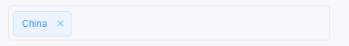

# El Input Tag

A tag input editor component for Vue 2 and Element UI.

> This package targets Vue 2 + Element UI. A Vue 3 / Element Plus version is not planned because Element Plus already provides its own input tag component.

<p align="center">
  
</p>

[中文 README](README-zh_CN.md)

## Install

```sh
npm i el-input-tag --save
```

## Usage

Register globally:

```js
import Vue from 'vue'
import ElementUI from 'element-ui'
import ElInputTag from 'el-input-tag'

Vue.use(ElementUI)
Vue.use(ElInputTag)
```

Register locally:

```js
import { ElInputTag } from 'el-input-tag'

export default {
  components: { ElInputTag }
}
```

Use with `v-model`:

```html
<el-form :model="form" ref="form">
  <el-form-item>
    <el-input-tag v-model="form.tags" placeholder="Add a tag" />
  </el-form-item>
</el-form>
```

```js
export default {
  data () {
    return {
      form: {
        tags: []
      }
    }
  }
}
```

## Props

| Attribute | Description | Type | Accepted Values | Default |
| --------- | ----------- | ---- | --------------- | ------- |
| value / v-model | Tag list | array | | `[]` |
| size | Input size | string | mini / small / medium | |
| read-only | Whether input is readonly | boolean | | `false` |
| placeholder | Input placeholder | string | | |
| add-tag-on-keys | Key codes that add the current tag | array | | `[13, 188, 9]` |
| transform-tag | Function used to transform a normalized string before saving | function | | `tag => tag` |
| validate-tag | Function used to validate a normalized string before saving | function | | `() => true` |

Element UI tag attributes such as `type`, `hit`, `color`, and `effect` are passed through to the internal `el-tag`.

## Events

| Event | Description | Parameters |
| ----- | ----------- | ---------- |
| input | Emitted for `v-model` updates | `tags` |
| invalid | Emitted when `validate-tag` rejects a tag or `transform-tag` returns `null` / `undefined` | `tag` |

## Examples

### Custom keys

By default, Enter, comma, and Tab add the current tag. You can customize this with `add-tag-on-keys`:

```html
<el-input-tag v-model="tags" :add-tag-on-keys="[13]" />
```

### Number arrays

Use `validate-tag` and `transform-tag` when you need a number array instead of a string array:

```html
<el-input-tag
  v-model="ids"
  :validate-tag="tag => /^\d+$/.test(tag)"
  :transform-tag="tag => Number(tag)"
/>
```

Typing `1,2,3` will emit `[1, 2, 3]`.

## Notes

This component wraps Element UI's `el-tag`, so Element UI must be installed and registered before using this component.
